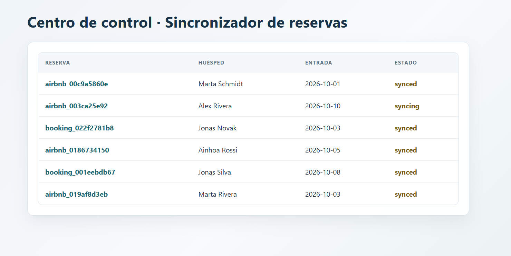

# Sincronizador de reservas

Un servicio que consulta reservas de los canales de venta (Booking, Airbnb), las
unifica en una estructura común y las sincroniza con el PMS de forma fiable:
confirma cada evento al canal en menos de 500ms, evita procesar la misma reserva
dos veces, y reintenta con espera creciente si el PMS falla, hasta marcarla como
fallida si no hay forma de completarla.

Mantuve la base en TypeScript que proporciona Workfactory, sin añadir Express ni
ningún framework: con `node:http` puro era suficiente para el alcance del
ejercicio, y evitaba una capa de complejidad que no aportaba nada aquí. El
frontend es HTML y JavaScript sin librerías, por el mismo motivo.



## API del servicio

| Método | Ruta | Descripción | Respuesta |
|---|---|---|---|
| `GET` | `/health` | Comprueba que el servicio está listo. | `200` `{ "ok": true }` |
| `GET` | `/` | Sirve el centro de control en HTML. | `200` documento HTML |
| `GET` | `/api/bookings` | Lista las reservas, más recientes primero. | `200` `{ "items": [{ "id": "booking_123", "channel": "booking", "guestName": "Ada Lovelace", "checkIn": "2026-10-01", "checkOut": "2026-10-04", "totalPrice": 300, "currency": "EUR", "status": "synced", "attempts": 1, "lastError": null, "pmsReference": "pms_123", "updatedAt": "2026-09-27T12:00:00.000Z" }] }` |
| `GET` | `/api/bookings/{id}` | Devuelve una reserva por ID. | `200` `BookingRecord`; `404` si no existe |
| `POST` | `/api/bookings/{id}/retry` | Reactiva una reserva fallida. | `202` `BookingRecord`; `409` si no está fallida; `404` si no existe |

## Cómo se arranca

Necesitas Node 22.6 o superior. No hay que instalar nada para el simulador ni
para correr el servicio con `node:http`; solo `@types/node` como dependencia de
desarrollo para que TypeScript resuelva los tipos de Node.

**1. El simulador de canales y PMS** (en una terminal, déjalo corriendo):

```bash
cd mock
node --experimental-strip-types src/application/local-main.ts
```

Queda escuchando en `http://localhost:4000`.

**2. El servicio** (en otra terminal):

```bash
cd backend
cp .env.example .env
npm install
npm start
```

Escucha en `http://localhost:3000`. Ábrelo en el navegador para ver el centro de
control con las reservas y sus estados. La pantalla carga los datos al abrirse;
recarga la página para consultar los cambios más recientes.

**3. Tests y comprobador:**

```bash
npm test          # tests unitarios
npm run check     # comprobador oficial, arranca el simulador y el servicio por su cuenta
```

**4. Con Docker**, en lugar de los pasos 2 y 3, con el simulador ya corriendo por fuera:

```bash
docker build -t booking-sync-bridge .
docker run --rm -p 3001:3000 \
  -e PORT=3000 \
  -e API_BASE=http://host.docker.internal:4000 \
  -e API_TOKEN=wf_local \
  booking-sync-bridge
```

**5. Contra la API real de Workfactory**: cambia en `.env` `API_BASE` a
`https://join.workfactory.es/api` y `API_TOKEN` a tu token. Lo probé así: el
servicio procesó y sincronizó correctamente las reservas que había disponibles,
hasta que el lote de datos de prueba se agotó (`/channels/events` empezó a
devolver `done: true` sin eventos).

## Cómo usé la IA

Usé GitHub Copilot como agente dentro de VS Code, apoyándome en el `AGENTS.md`
que venía con la base para que arrancara con el contexto correcto.

Al principio le pasé `AGENTS.md` y se puso a generar todo el código de golpe:
normalización, consumidor, endpoints y frontend a la vez. Lo paré ahí mismo,
porque quería ir paso a paso, verificando que cada pieza funcionara antes de
pasar a la siguiente, en vez de aceptar un bloque grande de una sola vez sin
haber comprobado nada por el camino.

A partir de ahí le fui pidiendo una pieza cada vez, empezando por que explorara
el código existente (los clientes de canal y PMS, el store, los tipos) y me
explicara su hipótesis de diseño antes de escribir el código.

Lo que acepté tal cual: la normalización de payloads (`normalizeChannelPayload`),
los tres endpoints REST sobre el `store` ya existente, y el frontend mínimo.

Lo que revisé y le hice ajustar: la primera versión comprobaba duplicados
*dentro* de la tarea en segundo plano, lo que dejaba una ventana pequeña donde
dos eventos casi simultáneos del mismo `booking_id` podían colarse los dos. Le
pedí que moviera esa comprobación a antes de crear la tarea, y que añadiera un
registro de "en proceso" aparte del `store`, para cubrir ese caso.

Más adelante le pedí que extrajera la lógica de deduplicación y sincronización
de `server.ts` a dos módulos aparte (`booking-processor.ts` y
`synchronization.ts`), con sus dependencias (`has`, `save`, `synchronize`) como
parámetros en vez de importadas directamente. Quería poder testear esa lógica
sin tener que levantar el servidor HTTP entero, y con esta estructura pude
añadir dos tests que usan versiones falsas de esas dependencias: uno que
comprueba que el mismo `booking_id` llegado dos veces a la vez solo llega una
vez al PMS, y otro que comprueba que tras agotar los reintentos la reserva
queda `failed`.

También le pedí una especificación OpenAPI de mis propios endpoints
(`openapi.yaml`), dándole como referencia los tipos de `domain.ts` y los
códigos de estado que ya devolvía `server.ts`, para no tener que mantener esa
información escrita dos veces por separado.

Lo que descarté: en algún punto proponía soluciones más elaboradas de lo que el
ejercicio necesitaba (capas o abstracciones extra que no aportaban nada al
alcance real), y opté por quedarme con la versión más simple y directa.

## Qué me encontré por el camino

Al revisar la primera versión de la deduplicación, vi que comprobaba duplicados
*dentro* de la tarea en segundo plano, dejando una ventana donde dos eventos
casi simultáneos del mismo `booking_id` podían colarse los dos. Lo corregí
moviendo esa comprobación a antes de crear la tarea, y añadiendo un registro de
"en proceso" aparte del `store` para cubrir ese hueco.

## Decisiones y qué dejé fuera

**Deduplicación en dos capas**: el `store` (persistente mientras el proceso vive)
para reservas ya guardadas, y un `Set` en memoria para las que están siendo
procesadas en ese instante, cubriendo la ventana entre el `ack` y el guardado.

**Reintentos**: 4 intentos con espera exponencial (100ms, 200ms, 400ms) antes de
marcar una reserva como `failed`. Elegí un número bajo porque el ejercicio pide
no perder reservas, no reintentar indefinidamente, y con la latencia del PMS
(3-5 segundos) más reintentos habría alargado mucho el tiempo hasta el estado
final.

**Dejé fuera, a propósito, la persistencia en disco o base de datos**: el estado
vive en memoria y se pierde si el proceso se reinicia. El enunciado no lo pedía,
y hubiera sido complejidad extra sin beneficio claro para el alcance de este
ejercicio; en un sistema real sería lo primero que añadiría.

## Qué me costó más

Nada supuso una dificultad grande en sí, pero lo que requirió más atención fue
razonar bien la parte de concurrencia: asegurarme de que el `ack` en menos de
500ms nunca quedara bloqueado por la normalización o el envío al PMS.